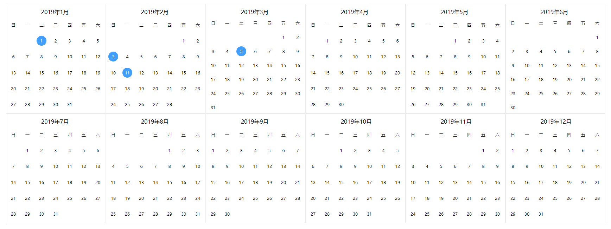

# v-calendar

> Calendar
> 简单实用的全年日历组件,按月份显示一年内所有天数



## 参数说明

`checked: 已选择日期数组，日期格式yyyyMMdd`

`clickHandler: 点击事件，参数为day对象`
```json
{
  index: "1",         // 索引
  value: "20190909",  // 值
  checked: true       // 选中
}
```


## 运行

``` bash
# install dependencies
npm install

# serve with hot reload at localhost:8080
npm run dev

# build for production with minification
npm run build

# build for production and view the bundle analyzer report
npm run build --report
```

For a detailed explanation on how things work, check out the [guide](http://vuejs-templates.github.io/webpack/) and [docs for vue-loader](http://vuejs.github.io/vue-loader).
